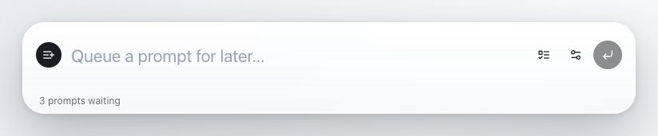

# Kyu

Kyu is a free, open-source macOS utility for queueing prompts when you run out of tokens or your agents are busy. Save prompts quickly with a keyboard shortcut, then release them.



> 🚧 Status: early prototype.

## ✨ Features

- Spotlight-style prompt bar, summoned with a global shortcut (`⌘⇧Space` by default).
- Inline highlighting of `/skills` and `@context` mentions as you type.
- Local prompt queue — release one prompt or the whole queue to the clipboard.
- Custom shortcut, recorded by pressing the key combo directly in Settings.
- Light, Dark, or Auto appearance.
- Optional menu-bar icon and start-at-login.

## 📦 Install

### Homebrew

```bash
brew install --cask playground-labs/kyu/kyu
```

The cask lives in the [`playground-labs/kyu`](https://github.com/Playground-Labs/homebrew-kyu) tap.

### Direct download

Grab the latest DMG from the [Releases page](https://github.com/Playground-Labs/Kyu/releases/latest):

- **Apple Silicon** (M1/M2/M3/M4): `Kyu_<version>_aarch64.dmg`
- **Intel**: `Kyu_<version>_x64.dmg`

Open the DMG and drag **Kyu** into Applications. On first launch macOS may block it because it is distributed outside the App Store — right-click Kyu and choose **Open**, or approve it under System Settings → Privacy & Security.

## 🛠️ Building from source

### Prerequisites

- macOS
- Node.js 22 and npm
- Xcode Command Line Tools
- Rust and Cargo — install via [rustup](https://rustup.rs) (`curl --proto '=https' --tlsv1.2 -sSf https://sh.rustup.rs | sh`), then restart your terminal.

### Setup

```bash
git clone https://github.com/Playground-Labs/Kyu.git
cd Kyu
npm install
```

### Run and build

```bash
npm run tauri -- dev     # run the app in development
npm run tauri -- build   # build a local macOS app
```

The bundled app is written to `src-tauri/target/release/bundle/`. As with a downloaded build, macOS may prompt you to approve a local build the first time you open it.

### Test

```bash
npm test                                           # frontend (Vitest)
cd src-tauri && cargo test --no-default-features    # Rust
```

Both suites also run on every push and pull request via GitHub Actions.

## 🧰 Tech Stack

Tauri 2 · React · Vite · TypeScript · Tailwind CSS · Shadcn-style local components.

## 📄 License

Kyu is free and open source under the [MIT License](LICENSE).
